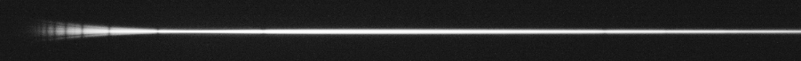
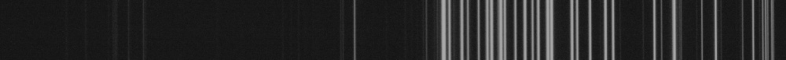
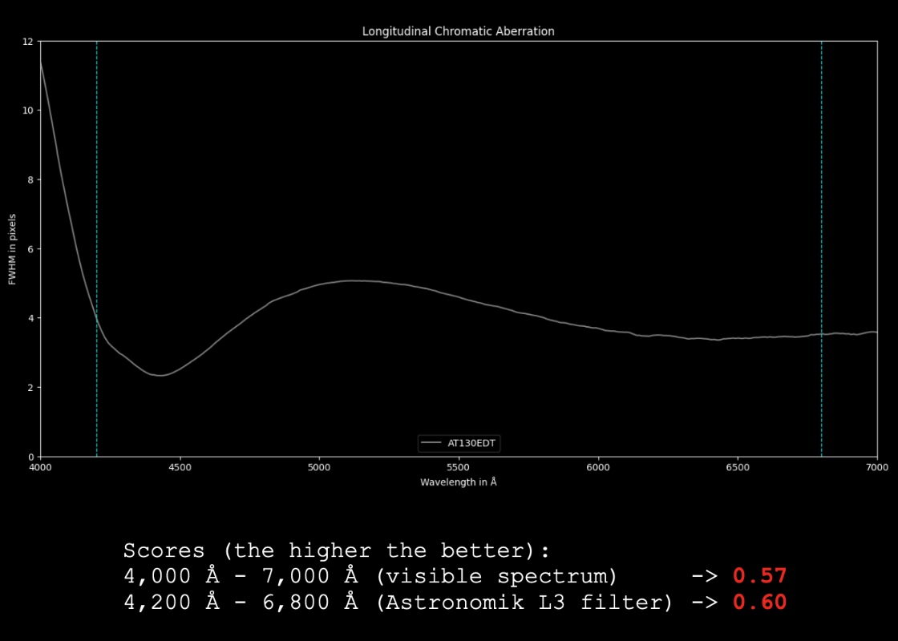

# Chromatic Aberration Estimator

This Python utility can be used to estimate the amount of longitudinal chromatic aberration in a refracting telescope.

## Installation

After cloning this repository, create a virtual environment using Python 3.x, and activate it:

```
# Create a virtual environment using Python 3.x:
> python -m venv env

# For Mac OS X or Linux:
> source env/bin/activate

# For Windows:
> env\Scripts\activate
```

Then, inside the virtual environment, upgrade `pip`:

```
(env) python -m pip install --upgrade pip
```

Finally, install the dependencies:

```
(env) pip install -r requirements.txt
```

## Usage

First, you will need to capture the 2D spectrum of a star of spectral type A or F across the entire visible region, i.e. from 4,000 Å to 7,000 Å. Here is an example (Theta Leonis) captured with my Astro-Tech AT130EDT triplet ED refractor, and the Star'Ex spectrograph in its low resolution configuration (4 second exposure):


If we stretch this image, for example in PixInsight, here is what it looks like:



We can now see the fishtail effect in the deep blue/near UV part of the spectrum (on the left side) caused by longitudinal chromatic aberration.

Additionally, you will need the corresponding 2D spectrum of a calibration lamp, e.g. a Neon-Argon lamp:



You can refer to [the atlas of Ne-Ar lines](NeAr.pdf) I included in this repository to identify the lines in this spectrum.

If you do not have such a calibration spectrum, you may use well-known absorption lines such as the Balmer series (ignoring, in first approximation, any doppler shift caused by the star's relative radial velocity...)

Finally, you can open [the included Python notebook](Estimate-Longitudinal-CA.ipynb) in VS Code (for example), and tweak the parameters, or the rendering as you see fit. The script assumes that the 2D spectrum is horizontal, and simply measures the thickness of the spectrum (FWHM of the star) for each wavelength, and renders it as a graph. It can also compute a score between `0.0` and `1.0` — the higher the value, the lower the longitudinal chromatic aberration.



You would expect that a mirrored telescope, such as a Ritchey-Chretien, would get a score of `1.0`. However, the optical elements inside the spectrograph also have some amount of aberrations (chromatic, spherical, astigmatism). Therefore, with my spectrograph, a value of `0.9` is about the highest that may be obtained. If you want, and are able to obtain a reference spectrum obtained with a telescope that is known to not have any chromatic aberration (Newtonian, Ritchey-Chretien), you may also divide the spectrum obtained through a refractor by your reference spectrum. This way, it may be easier and more accurate to compare the level color correction between various telescopes.

Enjoy!
